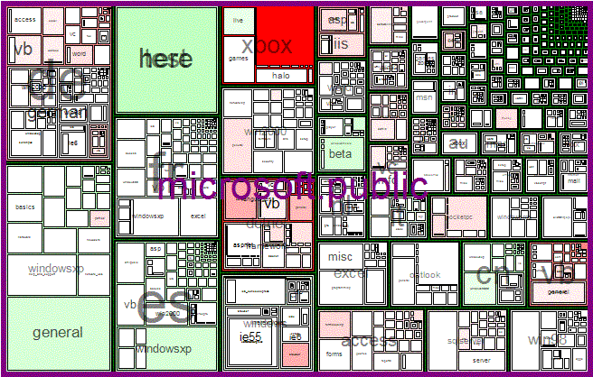

# Treemap

These libraries originally came from [Microsoft Research Downloads](http://research.microsoft.com/research/downloads/), and they were part of the [Data Visualization Components](http://research.microsoft.com/en-us/downloads/dda33e92-f0e8-4961-baaa-98160a006c27/default.aspx), which were free for non-commercial use and available under the Microsoft Research Shared Source License. Unfortunately, the libraries and code were last updated by Microsoft in 2006, and they targeted .NET 1.1, which was 32-bit only. By 2014, Microsoft Research no longer made the libraries or code available for download, and even the [Wayback Machine](https://web.archive.org/web/20101205013557/http://research.microsoft.com/en-us/downloads/dda33e92-f0e8-4961-baaa-98160a006c27/default.aspx) doesn't have the downloads.

This repo updates the 2006 code to:
* Build in Visual Studio 2019
* Use SDK-style projects
* Use the "Any CPU" platform
* Target .NET Framework 4.5 and .NET Core 3.1
* Produce NuGet packages

For more information:
* See Microsoft's [Treemap.chm](docs/Treemap.chm) Windows Help file for API-level details on using TreemapGenerator and TreemapControl.
* See [Treemap Visualizations of Newsgroups](https://www.microsoft.com/en-us/research/publication/treemap-visualizations-of-newsgroups/) for the October 2001 paper where these components were first used.
* See Wikipedia's [Treemapping](https://en.wikipedia.org/wiki/Treemapping) article.

## Microsoft Notes From 2006

The Microsoft Research Community Technologies team has developed two .NET components that render treemaps.  The TreemapGenerator is a drawing engine without its own user interface. It takes a set of hierarchical data, generates a treemap from the data, and draws it onto a bitmap or Graphics object provided by the caller. It can be used in a variety of environments, including Web applications that generate images on the server for downloading to client browsers.

The TreemapControl wraps the TreemapGenerator into a Windows Forms control.  It can be added to the Visual Studio toolbox and dropped into any Windows Forms application.

### What Is A Treemap?
A treemap is a rendering of hierarchical data as a set of nested boxes, where each box corresponds to one data element.  The nesting indicates the hierarchy, the box sizes are proportional to some attribute on each element, and the box colors are based on another attribute.

Here, for example, is the microsoft.public newsgroup hierarchy displayed as a treemap:

For a history of treemaps, see [Treemaps for Space-Constrained Visualization of Hierarchies](http://www.cs.umd.edu/hcil/treemap-history/index.shtml), by Ben Shneiderman at the University of Maryland.  Dr. Shneiderman invented treemaps.
